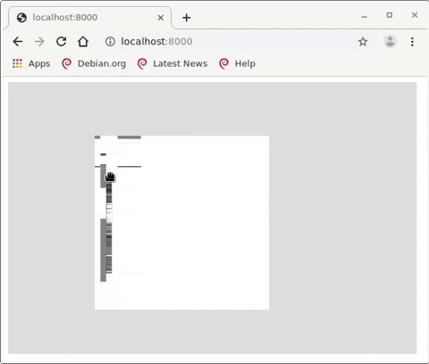

# Tools

## Visualization 

Some scripts in `tools` will generate a "map" of your dump, as well as tiles to be rendered in a Leaflet based
visualization thing in your browser.

*BE CAREFUL, THESE OPERATIONS TAKE A LOT OF SPACE*
*COUNT 6 TIMES THE SIZE OF YOUR FLASH DUMP*



What you are seeing is all the pages stacked together, then the very "high" column is split into 8 smaller colums, that
are then stitched together horizontally.

## Installation / Usage

You need to have `libvips-tools` installed.

Just run the script with a dump file and a page size, and wait for a bit

```
$ bash tools/viz.sh flash_3.bin  $((2048+64))
Making the sub-pics in pics/flash_3.bin/pgm ....
I'll generate 8 PGM files for file flash_3.bin
Writing pics/flash_3.bin/pgm/flash_3.bin_0_0-138412032.pgm
Writing pics/flash_3.bin/pgm/flash_3.bin_1_138412032-276824064.pgm
Writing pics/flash_3.bin/pgm/flash_3.bin_2_276824064-415236096.pgm
Writing pics/flash_3.bin/pgm/flash_3.bin_3_415236096-553648128.pgm
Writing pics/flash_3.bin/pgm/flash_3.bin_4_553648128-692060160.pgm
Writing pics/flash_3.bin/pgm/flash_3.bin_5_692060160-830472192.pgm
Writing pics/flash_3.bin/pgm/flash_3.bin_6_830472192-968884224.pgm
Writing pics/flash_3.bin/pgm/flash_3.bin_7_968884224-1107296256.pgm
Joining the sub-pics into pics/flash_3.bin.png ....
Starting webserver... Then open your web browser to http://localhost:8000
```
